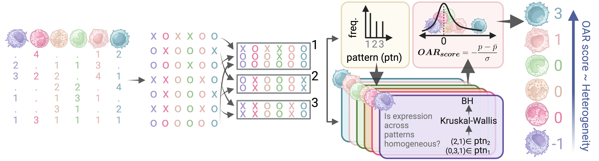

# OARscRNA

## Heterogeneity scoring on scRNAseq data based on missingness

The OAR (observed at random) score reveals cellular heterogeneity, allowing **cell prioritization** for downstream applications. The results of this test will highlight distinct cells within a dataset (cells with a high OAR score) for further exploration. For best results, test a group of similar cells where you expect some heterogeneity - *i.e. one cell type across various biological samples or conditions*. OAR scores are cluster agnostic (no cluster labels are required) and are robust across:

-   Technologies
-   Technical batches/library preparations
-   Organisms
-   Sampling

A **positive OAR score** within a dataset examined, highlights a cell with gene expression that appears more homogenous than other cells in the mixture and is consequently highly distinct cell. **OAR score is a measure of heterogeneity among cells**.

## Motivation

scRNAseq data is very sparse (50-90% of expression values are 0). Sparsity is *generally* attributed to technical limitations associated with capturing RNA molecules from individual cells. **Some 0s are expected**, and are a consequence of the Gamma-Poisson distribution of count data[^readme-1], whereas “Drop-out” (when 0 occurs where a positve count is expected) is a problem associated with specific technologies (UMI- vs. nonUMI-based)[^readme-2].

[^readme-1]: Svensson, V. (2020). Droplet scRNA-seq is not zero-inflated [DOI: 10.1038/s41587-019-0379-5](https://www.nature.com/articles/s41587-019-0379-5)

[^readme-2]: Cao, Y. *et. al.* (2021). UMI or not UMI, that is the question for scRNA-seq zero-inflation [DOI: 10.1038/s41587-020-00810-6](https://www.nature.com/articles/s41587-020-00810-6)

Sparsity has been used to:

-   [Cluster cells](https://doi.org/10.1038/s41467-020-14976-9)
-   [Define variable genes](https://academic.oup.com/bioinformatics/article/35/16/2865/5258099)

**Is there something else we can learn about cellular identity from sparsity in scRNAseq data?** **Is sparsity (\~missingness) occurring completely at random?**

## Test overview

At the core of the OAR score is the identification of missing data patterns, followed by comparing the distribution of genes expressed in the identified patterns in each cell individually.

To calculate the OAR score we:

1.  Estimate [Hamming distances](https://en.wikipedia.org/wiki/Hamming_distance) between binarized vectors of gene expression.
2.  Group genes across missing data patterns defined as those with small (0-0.05) Hamming distance. Genes with unique patterns *- i.e. with no "neighbors"*, are grouped together.
3.  Compare the distribution of gene expression in across identified patterns for *each cell* with a [Kruskal-Wallis](https://en.wikipedia.org/wiki/Kruskal%E2%80%93Wallis_test) test.
4.  Scale the resulting *corrected p value* distributions *across all cells* to obtain the **OAR score**.

## Installation

To install the latest version of our package, run:

`devtools::install_github("davidsanin/OARscRNA")`

## Usage

To calculate an OAR score from a Seurat with **default** parameters run:

`oar(data = seurat.obj)`

Or from a matrix of unnormalized read counts, run:

`oar(data = read.counts, seurat_v5 = F)`

This will automatically filter low expression genes, identify a suitable tolerance for the hamming distance, and return the OAR score, corrected and uncorrected p values and percentage of missing data for each cell (column) in the supplied object.

-   If a Seurat object is supplied, the results are added as columns in the `meta.data` slot.

For full details on all parameters, including a step by step breakdown of the process, please visit our [documentation](https://oar.readthedocs.io) or view our vignette with `browseVignettes(package = "oar")`.

## Tutorials and Applications

### Quick overview

Follow our [quick guide](https://oar.readthedocs.io/introdoctury_vignette) on running the analysis with a single line.

### Cell prioritization for downstream analysis

Follow our [step-by-step tutorial](https://oar.readthedocs.io/detailed_tutorial) on exploring how we can identify highly activated plasmacytoid dendritic cells based on a high OAR score.

### Model gene expression data at the single cell level

[Identify genes](https://oar.readthedocs.io/Gene_expression) responsible for high OAR scoring cells at a single cell resolution.

### Remove sources of variation from scRNAseq data analysis

Discover distinct clusters of disease associated immune cells in a Breast Cancer atlas after [regressing patient-driven high OAR scores](https://oar.readthedocs.io/signal_regression).

## References

*scRNAseq implementation:* Chen, R., Moore, H., Gueguen, PM., Kelly, B., Fertig, EJ., Sanin, DE., (2025). Scoring Cellular Heterogeneity by interrogating Missingness in single-cell RNA-seq Data. *In press*

*Statistical proof:* Chen, R., Chung, YC., Basu, S., Shi, Q., (2024). Diagnostic Test for Realized Missingness in Mixed-type Data. Sankhya B, 86(1), 109-138. DOI: 10.1007/s13571-023-00317-5
