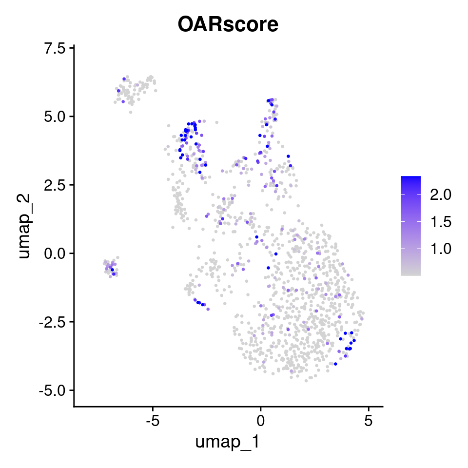
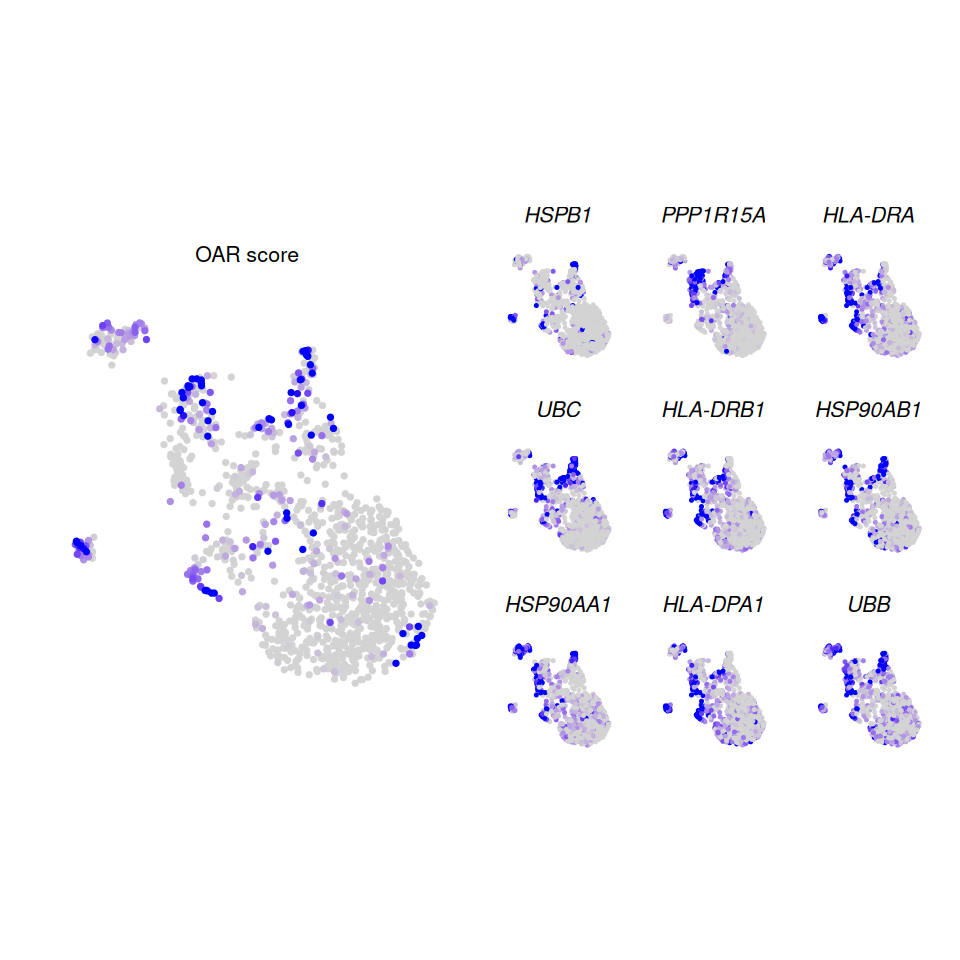

# Gene Expression Analysis based on OAR scores

``` r
library(OAR)
```

## Overview

In this vignette we will explore what genes are associated with
increased OAR scores. We will use our toy plasmacytoid dendritic cell
dataset that you can download from our [github
repository](https://github.com/Sanin-Lab/OARscRNA/tree/main/vignettes).

### 1. Calculating OAR scores

We can calculate OAR scores with a single line of code. We recommend you
follow the introductory tutorials for a full description of this
function. The result is a Seurat object with `OARscore`, `KW.pvalue`,
`KW.BH.pvalue` and `sparsity` values in the `meta.data` slot.

``` r
library(Seurat)
#> Loading required package: SeuratObject
#> Loading required package: sp
#> 'SeuratObject' was built under R 4.5.0 but the current version is
#> 4.5.2; it is recomended that you reinstall 'SeuratObject' as the ABI
#> for R may have changed
#> 'SeuratObject' was built with package 'Matrix' 1.7.3 but the current
#> version is 1.7.4; it is recomended that you reinstall 'SeuratObject' as
#> the ABI for 'Matrix' may have changed
#> 
#> Attaching package: 'SeuratObject'
#> The following objects are masked from 'package:base':
#> 
#>     intersect, t
sc.data <- oar(data = readRDS(file = "pdcs.rds"), 
               seurat_v5 = T, count.filter = 1,
               blacklisted.genes = NULL, suffix = "",
               cores = 1)
#> Warning in oar(data = readRDS(file = "pdcs.rds"), seurat_v5 = T, count.filter = 1, : Running process in fewer than 2 cores will considerably slow down progress
#> [1] "Extracting data..."
#> [1] "Extracting count tables"
#> [1] "Analysis started on:"
#> [1] "2025-12-03 21:35:36 UTC"
#> [1] "Identifying gene co-expression patterns..."
...
```

To explore which cells/clusters display transcriptional shifts, we can
visualize the results in a UMAP projection.

``` r
library(Seurat)
p1 <- FeaturePlot(
  sc.data, features = "OARscore", order = T, pt.size = 0.5, 
  min.cutoff = "q40", max.cutoff = "q90")
p1
```



Feature plot of OAR score

Notice that cells with a High OAR score in this dataset cluster
together.

### 2. Identify genes associated with OAR scores

In a typical scRNAseq analysis workflow, differential gene expression is
calculated based on averaged counts across identified clusters. Although
highly informative, this approach fundamentally looses the single cell
resolution achieved through this technology. As an alternative to using
cluster labels to model gene expression, which invites biases associated
with identifying clusters, we propose to model gene expression based
instead on the value of the OAR score. We implement this approach using
glmGamPoi[¹](#fn1), which has superior performance to other differential
gene expression methods in terms of speed and accuracy. Scaling factors
are calculated using
[`scran::calculateSumFactors()`](https://rdrr.io/pkg/scran/man/computeSumFactors.html),
which benefits from parallel computing.

``` r
oar_deg <- oar_deg(
    data = sc.data, seurat_v5 = T, score.name = "OARscore", 
    score = NULL, count.filter = 1,
    blacklisted.genes = NULL,
    splines = TRUE, degrees.freedom = 5,
    auto.threshold = TRUE, custom.tr = NULL)
#> [1] "Analysis started on:"
#> [1] "2025-12-03 21:35:44 UTC"
#> [1] "Extracting count tables"
#> [1] "FDR threshold set to:"
#> [1] 1e-12
#> Warning in oar_deg(data = sc.data, seurat_v5 = T, score.name = "OARscore", : Using splines increases calculation time by 3-5x
#> [1] "Analysis completed at:"
#> [1] "2025-12-03 21:36:38 UTC"
```

A brief explanation of these parameters is presented here:

- `data` may be an raw matrix of counts or a fully processed Seurat
  object with an OAR score calculated, as indicated by the `seurat_v5`
  parameter. The name of the score should be indicated in the
  `score.name` parameter.
- `score` only needs to be provided if starting from a count matrix and
  should be a vector of OAR scores in the same order as the columns of
  the count matrix.
- `count.filter` controls the minimum percentage of cells expressing any
  given gene for that gene to be retained in the analysis. Defaults to
  1.
- `blacklisted.genes`, Allows you to provide a vector of uninformative
  gene names (i.e. non-coding genes) to exclude from the analysis.
  **This analysis automatically excludes all ribosomal genes**. Defaults
  to `NULL`.
- `splines` and `degrees.freedom`, control whether splines should be fit
  based on the OAR score (and how many, as set by `degrees.freedom`) to
  capture non-linear associations between scores and gene expression. We
  recommend setting `splines` to `TRUE` and `degrees.freedom` between
  3-5. If `splines` is set to `FALSE`, only monotonic/linear
  associations will be retrieved.
- `auto.threshold` and `custom.tr` control the false discovery rate
  (**FDR**) threshold to consider a gene significantly associated with
  the OAR score. `auto.threshold` set to `TRUE` (**recommended**)
  estimates this threshold based on the number of cells tested.
  Typically, given the high number of observations, p values calculated
  based on individual cells tend to be highly significant, even where
  little association is observed between gene expression and the
  predictive variable. If `auto.threshold` set to `FALSE`, then a custom
  p value threshold should be provided with `custom.tr`. Setting this
  value to typical ranges (i.e. 0.05-0.01) will likely result in
  spurious associations.

The results of the analysis is a matrix with the regulated and filtered
genes:

``` r
oar_deg
#>              name         pval     adj_pval f_statistic df1      df2 lfc
#> 1           HSPB1 1.420100e-87 1.655695e-83    98.24009   5 1262.951  NA
#> 2        PPP1R15A 1.884017e-67 1.098288e-63    73.25076   5 1262.951  NA
#> 3         HLA-DRA 1.599269e-61 6.215294e-58    66.22267   5 1262.951  NA
#> 4             UBC 1.854397e-60 5.405103e-57    64.97655   5 1262.951  NA
#> 5        HLA-DRB1 5.356963e-60 1.249137e-56    64.43856   5 1262.951  NA
#> 6        HSP90AB1 3.049325e-56 5.925347e-53    60.08569   5 1262.951  NA
#> 7        HSP90AA1 1.649319e-50 2.747058e-47    53.54926   5 1262.951  NA
#> 8        HLA-DPA1 5.614897e-50 8.183010e-47    52.94923   5 1262.951  NA
#> 9             UBB 2.792879e-49 3.618020e-46    52.16515   5 1262.951  NA
...
```

For a full description of each column, visit the `glmGamPoi`
documentation. For our purposes, the `name` and `adj_pval` columns
(corresponding to genes and FDR, respectively) are the most important
results.

### 3. Visualize results

Overall, this analysis identifies 135 genes significantly associated
with OAR scores. If we plot the top 9 most significant genes alongside
our previously calculated OAR scores, we can observe that we identified
several candidates for further analysis:

``` r
library(Seurat)
library(patchwork)
library(ggplot2)

p1 <- FeaturePlot(
  sc.data, features = "OARscore", order = T, pt.size = 0.5, 
  min.cutoff = "q40", max.cutoff = "q90") + 
  labs(title = "OAR score") +
  theme(
      aspect.ratio = 1,
      legend.position = "none",
      axis.title = element_blank(),
      axis.text = element_blank(),
      axis.ticks = element_blank(),
      axis.line = element_blank(),
      plot.title = element_text(size = 8, face = "plain"))

p2 <- FeaturePlot(
  object = sc.data, pt.size = 0.1,
  slot = "counts",
  min.cutoff = "q40", max.cutoff = "q90",
  features = oar_deg$name[1:9], combine = F)

p2 <- lapply(p2, function(x){
  x +
    theme(
      aspect.ratio = 1,
      axis.title = element_blank(),
      axis.text = element_blank(),
      axis.ticks = element_blank(),
      axis.line = element_blank(),
      plot.title = element_text(
        size = 8, face = "italic")
    ) +
    NoLegend()
})

p1|wrap_plots(p2, ncol = 3)
```



Genes associated with OAR score

Here we can see several features associated with high OAR scoring cells
(i.e. *PPP1R15A, HSPB1, EIF1, UBC, NMI, DNAJC7, PMAIP1, SAR1A*) as well
as one (*B2M*) which is associated with low OAR scoring cells.

------------------------------------------------------------------------

1.  glmGapPoi: Fit Gamma-Poisson Generalized Linear Models Reliably.
    [git](https://github.com/const-ae/glmGamPoi)
