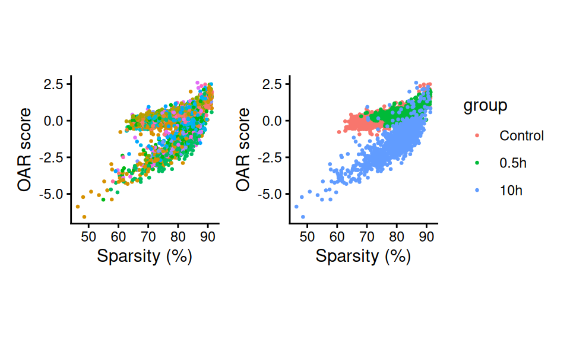
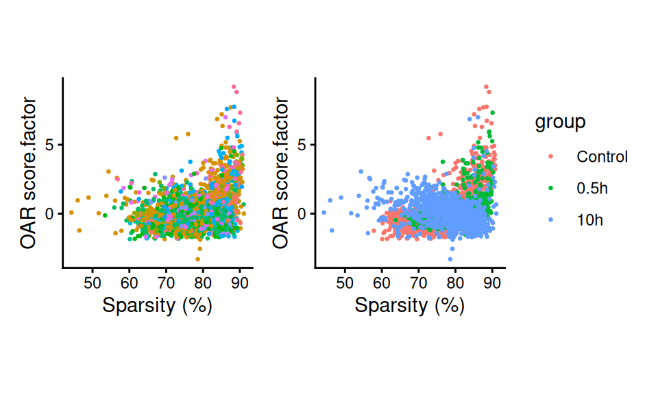
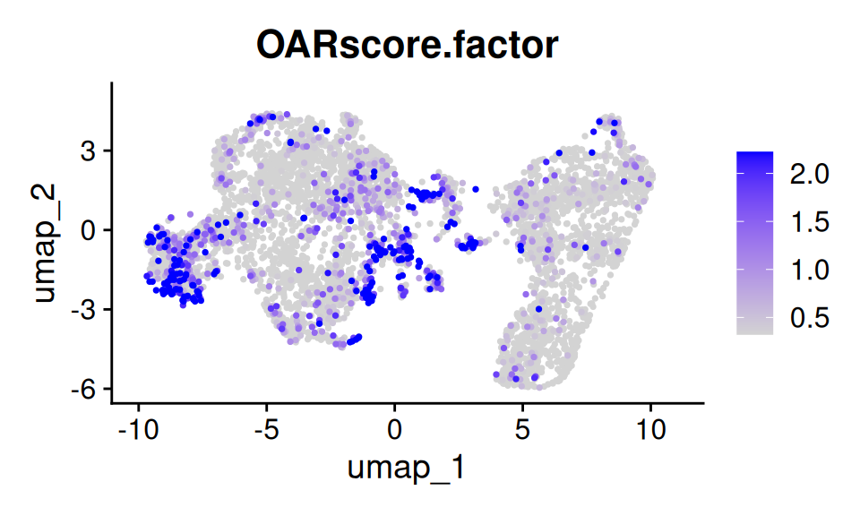

# Running OAR in a dataset split by Factors

``` r
library(OAR)
```

## Overview

In this tutorial we will walk you through generating OAR scores from
your single cell dataset separated by a factor in your data. We will
begin with a Seurat object with *Dictyostelium discoideum* cells (dicty)
that you can download from our [github repository](#id_0).

This approach is usually recommended when you have multiple cell types
in your dataset or your experimental conditions introduce dramatic
shifts in gene expression patterns. Our approach works best to detect
trasncriptional shifts within a set of cells that you expect to be
somewhat similar. Consequently, in situations like the ones outlined
above, it makes more sense to split the data by a factor before running
the analysis.

First, we will take a look at how the test performs when the data is not
split. Later we will run the analysis split by factors. As always, we
begin by loading the seurat object with the dataset we are interested
in.

``` r
library(Seurat)
#> Loading required package: SeuratObject
#> Loading required package: sp
#> 'SeuratObject' was built under R 4.5.0 but the current version is
#> 4.5.3; it is recomended that you reinstall 'SeuratObject' as the ABI
#> for R may have changed
#> 
#> Attaching package: 'SeuratObject'
#> The following objects are masked from 'package:base':
#> 
#>     intersect, t
sc.data <- readRDS(file = "dicty.rds")
sc.data
#> An object of class Seurat 
#> 13206 features across 5000 samples within 1 assay 
#> Active assay: RNA (13206 features, 2000 variable features)
#>  1 layer present: counts
#>  1 dimensional reduction calculated: umap
```

### 1. Running the full test

We can run the full test entire process with a single line. For a
description of all these parameters see our other vignettes. The result
is the Seurat object with the `OARscore`, `KW.pvalue`, `KW.BH.pvalue`
and `sparsity` values in the `meta.data` slot.

``` r
sc.data <- oar(data = sc.data, 
               seurat_v5 = T, count.filter = 1,
               blacklisted.genes = NULL, suffix = "",
               store.hamming = F,
               cores = 1)
#> Warning in oar(data = sc.data, seurat_v5 = T, count.filter = 1, blacklisted.genes = NULL, : Running process in fewer than 2 cores will considerably slow down progress
#> [1] "Extracting data..."
#> [1] "Extracting count tables"
#> [1] "Analysis started on:"
#> [1] "2026-03-26 16:30:48 UTC"
#> [1] "Identifying gene co-expression patterns..."
...
```

To explore the results we can visualize `OARscore` vs `sparsity` values,
coloring the cells based on some of the attributes in our Seurat object
meta.data.

``` r
library(patchwork)
library(ggplot2)
p1 <- scatter_score(sc.data, pt.size = 0.5)+NoLegend()
p2 <- scatter_score(sc.data, pt.size = 0.5, group.by = "group")
p1+p2
```



Scatter Plots by Factors

Here we can see that the underlying biological conditions are resulting
in very different sets of OARscores. In particular, 10h of starvation,
induces a completely separate profile of values. For that reason,
running the test separating the data by this biological variable will
allow us to prioritize cells within each condition for further analysis.

### 2. Analysis by Factor

OAR scores are typically more informative when distinguishing among
cells of the same type. When working with a dataset with diverse cell
types or dramatically affected by a biological variable, it can be
helpful to split the data by that factor and run the test independently.
This can be easily accomplished with our wrapper function, which takes
the same parameters as we have discussed before and returns a Seurat
object containing the results of the analysis.

``` r
sc.data <- oar_by_factor(sc.data, cores = 1, factor = "group", suffix = ".factor")
#> [1] "Splitting data by specified factor..."
#> Warning in FUN(X[[i]], ...): Running process in fewer than 2 cores will considerably slow down progress
#> [1] "Extracting data..."
#> [1] "Extracting count tables"
#> [1] "Analysis started on:"
#> [1] "2026-03-26 16:31:05 UTC"
#> [1] "Identifying gene co-expression patterns..."
...
#> Warning in FUN(X[[i]], ...): Running process in fewer than 2 cores will considerably slow down progress
#> [1] "Extracting data..."
#> [1] "Extracting count tables"
#> [1] "Analysis started on:"
#> [1] "2026-03-26 16:31:14 UTC"
#> [1] "Identifying gene co-expression patterns..."
...
#> Warning in FUN(X[[i]], ...): Running process in fewer than 2 cores will considerably slow down progress
#> [1] "Extracting data..."
#> [1] "Extracting count tables"
#> [1] "Analysis started on:"
#> [1] "2026-03-26 16:31:18 UTC"
#> [1] "Identifying gene co-expression patterns..."
...
```

Now let us examine the outcome of this analysis:

``` r
p3 <- scatter_score(sc.data, pt.size = 0.5, suffix = ".factor")+NoLegend()
p4 <- scatter_score(sc.data, pt.size = 0.5, group.by = "group", suffix = ".factor")
p3+p4
```



Scatter Plots by Factors

As you can see, we are able to identify trasncriptional shifts within
each biological condition. Moreover, we can visualize these results in a
UMAP projection of the using
[`Seurat::FeaturePlot()`](https://satijalab.org/seurat/reference/FeaturePlot.html).

``` r
p5 <- FeaturePlot(
  sc.data, features = "OARscore.factor", order = T, pt.size = 0.5, 
  min.cutoff = "q40", max.cutoff = "q90")
p5
```



Results by factor
