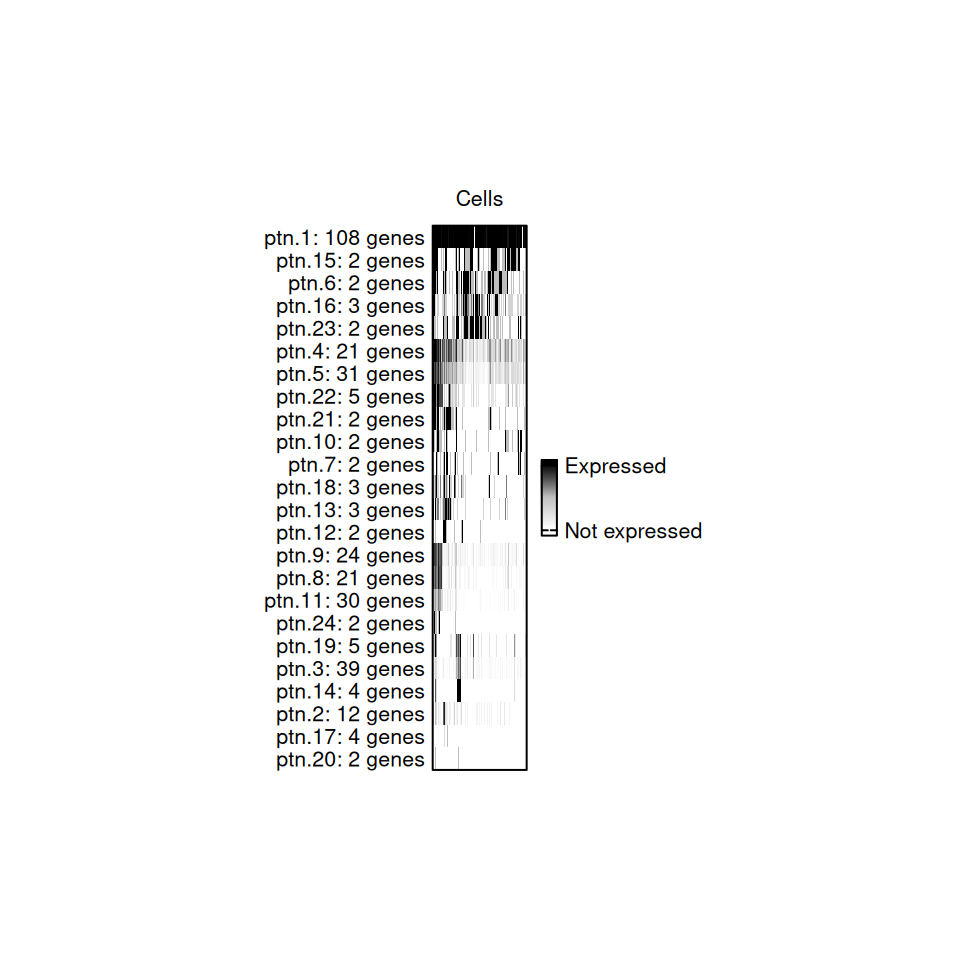
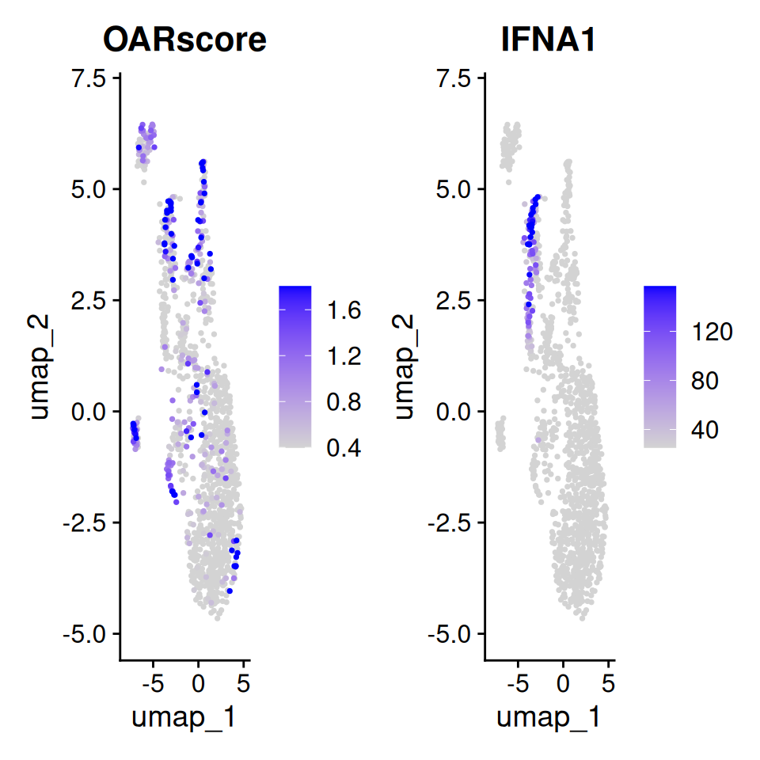

# Step-by-step guide to running OAR

``` r
library(OAR)
```

## Overview

In this tutorial we will walk you through all the steps of generating
and analyzing OAR scores from your single cell dataset. We will begin
with a Seurat object with plasmacytoid dendritic cells that you can
download from our [github
repository](https://github.com/Sanin-Lab/OARscRNA/tree/main/vignettes).

The process starting from a gene expression matrix is very similar and
you should be able to adapt this workflow to that input. Skip a few
lines down to the **data pre-processing step** to run the tutorial that
way.

At the end, we provide an alternative single line [wrapper
function](https://sanin-lab.github.io/OARscRNA/articles/wrapper-functions-and-result-interpretation)
that runs the whole process, and adds the results to the `meta.data`
slot of a Seurat object. If starting from a dataset with multiple cell
types or where a biological perturbation greatly alters gene expression,
we recommend running this process splitting the data by that factor, and
similarly provide a wrapper function that accomplishes that.

### 1. Loading and pre-processing your data

First, we load a Seurat object that we wish examine and store the cell
barcodes so we can later assign them to our output.

``` r
sc.data <- readRDS(file = "pdcs.rds")
cells = colnames(sc.data)
sc.data
#> An object of class Seurat 
#> 14362 features across 1243 samples within 1 assay 
#> Active assay: RNA (14362 features, 2000 variable features)
#>  1 layer present: counts
#>  2 dimensional reductions calculated: pca, umap
```

Now lets set a count threshold where we only analyze genes expressed in
at least 1% of cells[¹](#fn1). We do not recommend using thresholds
higher than 4%, as information will be lost.

``` r
tr = 1
```

Next, we retrieve the un-normalized count data from the Seurat object,
filter low abundance genes and remove genes that are
uninformative[²](#fn2). The output of this function is a list with the
first element being the processed matrix and the second the list of
genes in that matrix after filtering. We will skip the later for this
tutorial. Zero-counts in the processed matrix are denoted as `NA`.

``` r
oar_data <- oar_preprocess_data(
  data = sc.data, tr = tr, 
  seurat_v5 = T, blacklisted.genes = NULL)
#> [1] "Extracting count tables"
oar_data[[1]][1:5,1:5]
#>      [,1] [,2] [,3] [,4] [,5]
#> [1,]   NA    1   NA    1   NA
#> [2,]   NA   NA   NA   NA   NA
#> [3,]   NA   NA    1   NA   NA
#> [4,]   NA   NA   NA   NA   NA
...
```

For a full description of each parameter consult the documentation.
Briefly:

- `seurat_v5` confirms the type of data being used. Defaults to `TRUE`.
  If **starting from a data matrix**, set this to `FALSE` and continue
  with the rest of the tutorial.
- `tr` controls the minimum percentage of cells expressing any given
  gene for that gene to be retained in the analysis. Defaults to 1.
- `blacklisted.genes` allows you to provide a vector of uninformative
  gene names (i.e. non-coding genes) to exclude from the analysis.
  Defaults to `NULL`.

### 2. Identifying gene co-expression patterns

Our scoring relies on defining gene co-expression patterns based on a
binarized count matrix. To do this, we can identify genes with minimal
mismatch between them, but we need to first enable R to run in parallel.
To determine how many thread are available in your computer, you can run
[`parallelly::availableCores()`](https://parallelly.futureverse.org/reference/availableCores.html).
Leave at least 1-2 cores available for other processes running in your
computer to prevent crashing. Using multiple cores is recommended as
pattern identification will go much faster.

``` r
parallelly::availableCores()
#> system 
#>      4
```

Now we can select an appropriate number to set up parallel processing
for this R session. To identify patterns allowing for mismatch, we
calculate the hamming distance between all pairs of gene expression
vectors. Internally, the gene vectors are converted to 0 (absent) and 1
(expressed) values. This function needs to have the number of cores
specified explicitly.

``` r
dm <- oar_hamming_distance(
  oar_data[[1]], cores = 1)
#> [1] "Calculating Hamming distances between gene vectors using specified cores."
#> [1] "This operation may take several minutes"
#> OpenMP reports: max_threads = 1, num_procs = 4, actual used = 1
#> OpenMP reports: max_threads = 1, num_procs = 4, actual used = 1
#> OpenMP reports: max_threads = 1, num_procs = 4, actual used = 1
...
dm[[1]][1:5,1:5]
#>            1          2          3          4          5
#> 1 0.00000000 0.02976669 0.02976669 0.02815768 0.02976669
#> 2 0.02976669 0.00000000 0.03218021 0.02896219 0.03378922
#> 3 0.02976669 0.03218021 0.00000000 0.02735318 0.03218021
#> 4 0.02815768 0.02896219 0.02735318 0.00000000 0.02896219
...
```

The output is a list of matrices, with each matrix containing a set of
genes grouped based on overall sparsity, and where the hamming distance
between pairs of gene expression vectors within each matrix is
calculated. Expression binning is introduced to increase computational
performance and introduce a dynamic threshold to identify patterns. In
the wrapper function `oar` you have the possibility of storing this
result in your Seurat object, so that future score calculations are
completed faster. The wrapper function automatically detects a
previously calculated hamming distance matrix and uses that for further
analysis. **WARNING: If you use a different count filter value, or a
different set of cells, these distances will no longer be appropriate.
In that case, remove previously calculated distance matrix using**
`oar_obj[["RNA"]]@misc <- list()`.

Next, we want to group genes into co-expression patterns based on a
minimal hamming distance threshold.

``` r
gcp <- oar_patterns(oar_data[[1]], dm)
#> [1] "Identified 24 gene co-expression patterns"
#> [1] "A total of 331 genes captured in co-expression patterns"
table(gcp)
#> gcp
#>  ptn.1 ptn.10 ptn.11 ptn.12 ptn.13 ptn.14 ptn.15 ptn.16 ptn.17 ptn.18 ptn.19 
#>    108      2     30      2      3      4      2      3      4      3      5 
#>  ptn.2 ptn.20 ptn.21 ptn.22 ptn.23 ptn.24  ptn.3  ptn.4  ptn.5  ptn.6  ptn.7 
#>     12      2      2      5      2      2     39     21     31      2      2 
...
```

**A few considerations on pattern matching:** Allowing only for exact
matches results in very few, and often no, co-expressed gene patterns,
which is why our method makes this process more flexible. Internally,
each gene expression bin is assigned a separate minimal hamming distance
threshold (minimum of 0.01), which is used to generate an adjacency
matrix for all genes. Then a graph is built based on this matrix and the
eccentricities of all nodes calculated. Then the minimal hamming
distance threshold is adjusted to cap the eccentricity of all nodes to
maintain pattern integrity. We recommended you plot `KW.BH.pvalue`
vs. `sparsity` to examine the results. You should observe no
relationship between these variables, other than higher p values in some
**- but not all -** cells with a high sparsity (defined here as a
percentage of genes with 0 counts within each cell).

We can visualize these results of the pattern search by using:

``` r
p3 <- oar_gcp_plot(data = oar_data[[1]], gcp = gcp, seurat_v5 = FALSE)
#> [1] "Generating plots..."
p3
```



Gene co-expression patterns Plot

Each slice of the bar represents a cell, and it is colored based on what
percentage of genes from that pattern are expressed in each cell.

### 3. Calculate OAR scores

Now we are ready to do a cell-wise estimation of the overlap between the
gene expression distributions in each detected pattern. When these
distributions are distinct we obtain a highly significant p value and an
OAR score of less than 2. Alternatively, when these distributions
overlap cells have a larger p value and an OAR score greater than 2.
**Thus, a cell where the patterns defined in the whole dataset do not
explain gene expression, will have a with a high OAR score and is
potentially distinct from all others.** Critically, our test
incorporates both the gene expression values and the gene co-expression
patterns.

``` r
output <- oar_base(data = oar_data[[1]], gcp = gcp)
output$barcodes = cells #add back our barcodes
output
#>           OARscore    KW.pvalue KW.BH.pvalue sparsity             barcodes
#> 1     0.4991194964 1.310249e-74 1.672114e-74 79.46352 AAACCTGAGAACAATC-1_1
#> 2    -0.5335102274 9.891672e-83 3.595131e-82 87.92927 AAACCTGAGGTGCTAG-1_1
#> 3    -1.0294046721 7.161214e-87 7.474225e-86 85.27251 AAACCTGGTAGCAAAT-1_1
#> 4    -1.3317223078 2.258655e-89 4.253800e-88 78.79720 AAACGGGGTACCCAAT-1_1
...
```

The result is a matrix with these columns:

- `OARscore` is a metric of transcriptional shifts in the data, with a
  higher OAR score highlighting cells with gene expression patterns
  dissimilar from all others tested.
- `KW.pvalue` is the p-value generated by Kruskal-Wallis test.
- `KW.BH.pvalue` is the Benjamini-Hochberg corrected p-value.
- `sparsity` is the percent of genes in each cell with a count of 0.

We can now proceed to visualize these results to identify which cells
display transcriptional shifts.

### 4. Visualize results

A higher OAR score is a way to prioritize cells for further analysis.
Greater scores indicate distinct cell expression signatures, where high
scoring cells have different gene co-expression patterns compared to all
other cells in the test. In this example, we observe that cells with a
high degree of sparsity, also have a high OAR score

``` r
library(ggplot2)
p1 <-ggplot(
  data = output,
  aes(x = sparsity,
      y = OARscore, 
      color = -log10(KW.BH.pvalue))) + 
  geom_point(size = 0.5) + 
  labs(
    x = "Sparsity (%)",
    y = "OAR score") +
  geom_hline(
    yintercept = 2, linetype = "dashed", 
    color = "black", linewidth = 0.25) +
  scale_colour_gradientn(
    colours = (c("#000004FF","#3B0F70FF","#8C2981FF",
                    "#DE4968FF", "#FE9F6DFF","#FCFDBFFF")),
    na.value = "transparent", 
    name = expression(-Log[10]~BH.pval),
    guide = guide_colorbar(
      frame.colour = "black",
      frame.linewidth = 0.2,
      ticks.linewidth = 0.2,
      ticks.colour = "black")) +
  theme(
    aspect.ratio = 1,
    panel.grid = element_blank(),
    panel.background = element_blank(),
    axis.line = element_line(linewidth = 0.5),
    legend.text = element_text(size = 6), 
    legend.title = element_text(size = 8),
    legend.key.size = unit(3, "mm"),
    axis.text = element_text(size = 6), 
    axis.title = element_text(size = 8),
    plot.title = element_blank())
p1
```


Scatter Plots

You may recreate this plot using
[`scatter_score()`](https://sanin-lab.github.io/OARscRNA/reference/scatter_score.md).

In order to fully understand the features in the dataset driving the
high OAR score in some cells, it will be necessary to annotate these
with their biological context. This is more easily achieved within a
Seurat object with the additional experimental details.

### 5. Wrapper functions and result interpretation

We can run this entire process with a single line. The result is the
Seurat object with the `OARscore`, `KW.pvalue`, `KW.BH.pvalue` and
`sparsity` values in the `meta.data` slot. Additionally, genes are
annotated by which gene co-expression patterns they have been included
in `sc.data@assays$RNA@meta.data`.

``` r
sc.data <- oar(data = sc.data, 
               seurat_v5 = T, count.filter = 1,
               blacklisted.genes = NULL, suffix = "",
               store.hamming = T,
               cores = 1)
#> Warning in oar(data = sc.data, seurat_v5 = T, count.filter = 1, blacklisted.genes = NULL, : Running process in fewer than 2 cores will considerably slow down progress
#> [1] "Extracting data..."
#> [1] "Extracting count tables"
#> [1] "Analysis started on:"
#> [1] "2025-12-10 18:16:55 UTC"
#> [1] "Identifying gene co-expression patterns..."
...
```

We set these parameters based on our earlier discussion:

- `seurat_v5` confirms the type of data being used. Defaults to `TRUE`.
- `count.filter` controls the minimum percentage of cells expressing any
  given gene for that gene to be retained in the analysis. Defaults to
  1.
- `blacklisted.genes` Allows you to provide a vector of uninformative
  gene names (i.e. non-conding genes) to exclude from the analysis.
  Defaults to `NULL`.
- `suffix` Allows you to provide a character string to avoid overwriting
  previous OAR calculations. Defaults to `NULL`.
- `store.hamming` allows you to store the calculated hamming distances
  for pattern matching in your Seurat object for faster re-calculation
  of the scores if you need to alter other parameters later (found in
  `oar_obj[["RNA"]]@misc`). Defaults to `TRUE`.

You can use a similar approach to analyse the data cluster by cluster -
recommended when you have multiple cell types - or separated by another
variable in your data. In that case, use
[`oar_by_factor()`](https://sanin-lab.github.io/OARscRNA/reference/oar_by_factor.md)
and see
[`vignette("OAR_Factor")`](https://sanin-lab.github.io/OARscRNA/articles/OAR_Factor.md)
for more details.

##### Interpreting high OAR scores

To explore which cells/clusters display transcriptional shifts, we can
project the scores to our UMAP using
[`Seurat::FeaturePlot()`](https://satijalab.org/seurat/reference/FeaturePlot.html).
Notice that cells with a high OAR score in this dataset cluster
together. In fact, in this case, high OAR scoring cells represent the
most activated cells in the experiment, as can be seen when we examine
*IFNA1*, which is expressed in activated plasmacytoid dendritic cells.

``` r
library(Seurat)
#> Loading required package: SeuratObject
#> Loading required package: sp
#> 'SeuratObject' was built under R 4.5.0 but the current version is
#> 4.5.2; it is recomended that you reinstall 'SeuratObject' as the ABI
#> for R may have changed
#> 'SeuratObject' was built with package 'Matrix' 1.7.3 but the current
#> version is 1.7.4; it is recomended that you reinstall 'SeuratObject' as
#> the ABI for 'Matrix' may have changed
#> 
#> Attaching package: 'SeuratObject'
#> The following objects are masked from 'package:base':
#> 
#>     intersect, t
p1 <- FeaturePlot(
  sc.data, features = c("OARscore","IFNA1"), order = T, pt.size = 0.5, 
  min.cutoff = "q40", max.cutoff = "q90", slot = "counts")
p1
```



Feature plot of OAR score

Thus, in this dataset we are able to identify highly activated cells
with a cluster agnostic approach. We provide additional tutorials to
identify genes associated with a high OAR score (see:
[`vignette("Gene_expression")`](https://sanin-lab.github.io/OARscRNA/articles/Gene_expression.md)).
We have also seen datasets where high scores are associated with
biological variation that may be removed from the analysis to glean
additional insights into the populations of cells studied. These can be
achieved by passing `OARscore` to `vars.to.regress` in
[`Seurat::SCTransform()`](https://satijalab.org/seurat/reference/SCTransform.html).

------------------------------------------------------------------------

1.  *Filtering genes may reduce the time it takes to run the analysis.*

2.  *Filtering genes may reduce the time it takes to run the analysis.*
