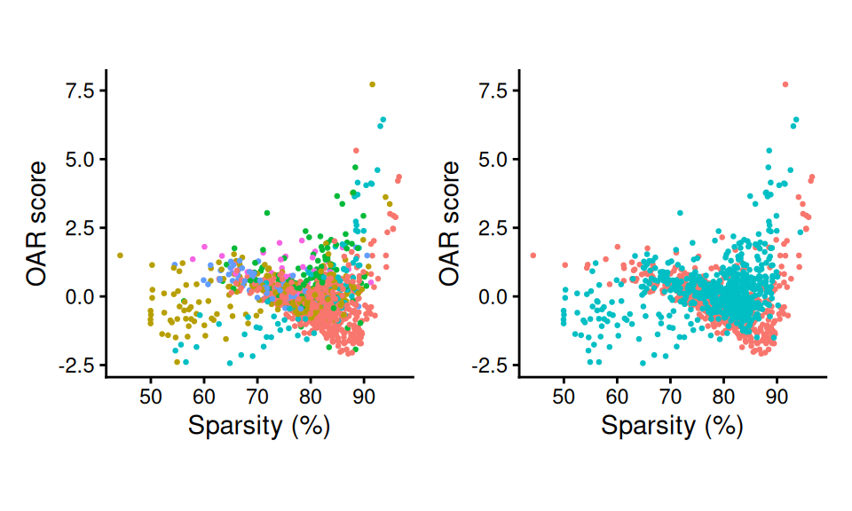
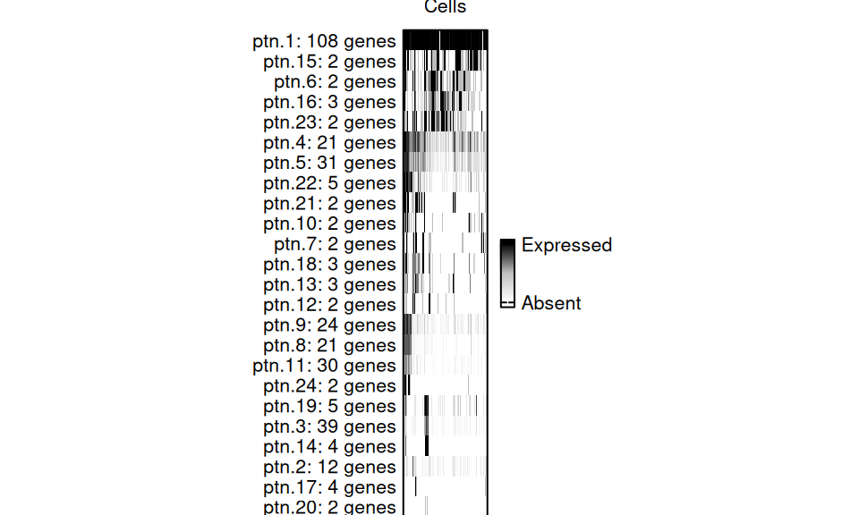
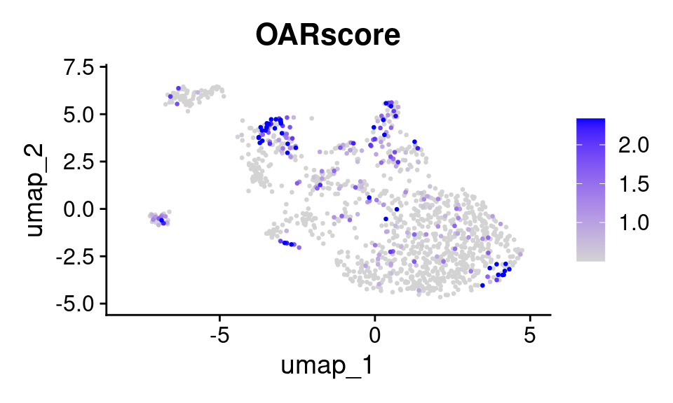
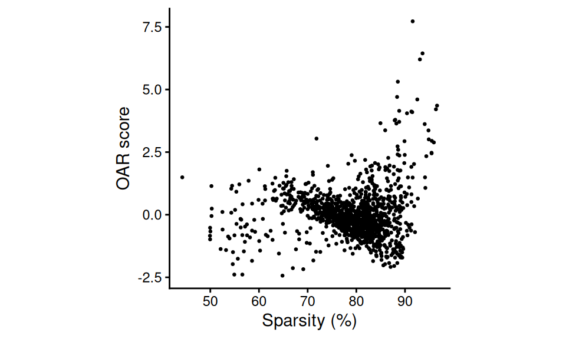

# Introductory Vignette for OARscRNA

``` r
library(OAR)
```

## Overview

In this vignette we will walk you through the very basic steps of
generating and analyzing OAR scores from your single cell dataset.

There are two possible starting points:

1.  Seurat v5 Object
2.  Gene Expression Matrix

Here we will walk you through steps of the analysis, beginning with a
gene expression matrix from plasmacytoid dendritic cell dataset that you
can download from our [github
repository](https://github.com/Sanin-Lab/OARscRNA/tree/main/vignettes).

### Starting from v5 Seurat Object

#### Analysis

We can directly input a Seurat object to examine transcriptional shifts.

``` r
data_obj <- readRDS(file = "pdcs.rds")
data_obj
#> An object of class Seurat 
#> 14362 features across 1243 samples within 1 assay 
#> Active assay: RNA (14362 features, 2000 variable features)
#>  1 layer present: counts
#>  2 dimensional reductions calculated: pca, umap
```

Once you have the seurat version 5 object loaded, you can run the oar
function. This function requires the input data, as well as some
information on the number of cores (which is set to 1 by **DEFAULT**).

To determine how many threads are available for the analysis, you can
run
[`parallelly::availableCores()`](https://parallelly.futureverse.org/reference/availableCores.html).
Leave at least 1-2 cores available for other processes running in your
computer to prevent crashing. Using multiple cores is recommended as
pattern identification will go much faster.

``` r
oar_obj <- oar(data_obj, cores = 1)
#> Warning in oar(data_obj, cores = 1): Running process in fewer than 2 cores will considerably slow down progress
#> [1] "Extracting data..."
#> [1] "Extracting count tables"
#> [1] "Analysis started on:"
#> [1] "2025-12-03 20:31:07 UTC"
#> [1] "Identifying gene co-expression patterns..."
...
```

We deliberately left most parameters to their default values, however we
recommend you explore each to familiarize yourself with their impact on
the result. Some critical parameters to consider include:

- `seurat_v5` confirms the type of data being used. Defaults to `TRUE`.
- `count.filter` controls the minimum percentage of cells expressing any
  given gene for that gene to be retained in the analysis. Defaults to
  1.
- `blacklisted.genes` allows you to provide a vector of uninformative
  gene names (i.e. non-coding genes) to exclude from the analysis.
  Defaults to `NULL`.
- `store.hamming` allows you to store the calculated hamming distances
  for pattern matching in your Seurat object for faster re-calculation
  of the scores if you need to alter other parameters later (found in
  `oar_obj[["RNA"]]@misc`). Defaults to `TRUE`.

The result is a Seurat object with these additional metadata columns:

- `OARscore` is a metric of transcriptional shifts in the data, with a
  higher OAR score highlighting cells with gene expression patterns
  dissimilar from all others tested.
- `KW.pvalue` is the p-value generated by Kruskal-Wallis test.
- `KW.BH.pvalue` is the Benjamini-Hochberg corrected p-value.
- `sparsity` is the percent of genes in each cell with a count of 0.

Additionally, genes are annotated by which gene co-expression pattern
they have been included in. This matrix is added to the assay metadata
(found in <oar_obj@assays>\$<RNA@meta.data>).

#### Analysis by Factor

OAR scores are typically more informative when distinguishing among
cells of the same type. When working with a dataset with diverse cell
types or dramatically affected by a biological variable, it can be
helpful to split the data by that factor and run the test independently.
See `vignette("OAR_Factors")` for more details.

``` r
oar_obj_byfactor <- oar_by_factor(data_obj, cores = 1, factor = "ident")
```

This functions takes the same parameters as `oar`, but it will not store
the calculated hamming distances in the resulting Seurat object.

#### Visualize Results

Below are a few examples of how you might explore the results of this
analysis.

##### OARscore v Sparsity Scatter Plot

``` r
library(patchwork)
library(ggplot2)
p1 <- scatter_score(oar_obj, pt.size = 0.5)+theme(legend.position = "none")
p2 <- scatter_score(oar_obj, pt.size = 0.5, group.by = "condition")+theme(legend.position = "none")
p1+p2
```



Scatter Plots

These plot reveals which clusters have the highest OAR scores, as well
as how the score relates to sparsity. Adjust the `group.by` metric to
examine other variables.

##### Gene co-expression Patterns

In some cases, you might want to explore the patterns that were
identified during the analysis to understand what the co-expression gene
modules are telling you. First, you can visualize these patterns like
this:

``` r
p3 <- oar_gcp_plot(oar_obj)
#> [1] "Extracting count tables"
#> [1] "Generating plots..."
p3
```



CGP Plot

For this dataset, we identified 24 sets of genes. Each slice of the bar
represents a cell, and it is colored based on what percentage of genes
from that pattern are expressed in each cell.

To get a data.frame of the genes within each pattern, use:

``` r
gcp <- get_pattern_genes(oar_obj)
```

It is also possible to retrieve patterns when
[`oar_by_factor()`](https://sanin-lab.github.io/OARscRNA/reference/oar_by_factor.md)
is applied. Please see the documentation for
[`get_pattern_genes()`](https://sanin-lab.github.io/OARscRNA/reference/get_pattern_genes.md)
for more details. Currently, the
[`oar_gcp_plot()`](https://sanin-lab.github.io/OARscRNA/reference/oar_gcp_plot.md)
is not supported when
[`oar_by_factor()`](https://sanin-lab.github.io/OARscRNA/reference/oar_by_factor.md)
is executed.

##### Score projection with Seurat FeaturePlot

As the scores, p values and sparsity have been added as columns to the
`meta.data` of the Seurat object, you can use all the native functions
from that package to visualize your results.
[`Seurat::FeaturePlot()`](https://satijalab.org/seurat/reference/FeaturePlot.html)
in particular, is a good starting point to get an overview of how the
score is distributed among cells and clusters.

``` r
library(Seurat)
#> Loading required package: SeuratObject
#> Loading required package: sp
#> 'SeuratObject' was built under R 4.5.0 but the current version is
#> 4.5.2; it is recomended that you reinstall 'SeuratObject' as the ABI
#> for R may have changed
#> 'SeuratObject' was built with package 'Matrix' 1.7.3 but the current
#> version is 1.7.4; it is recomended that you reinstall 'SeuratObject' as
#> the ABI for 'Matrix' may have changed
#> 
#> Attaching package: 'SeuratObject'
#> The following objects are masked from 'package:base':
#> 
#>     intersect, t
p4 <- FeaturePlot(
  oar_obj, features = "OARscore", order = T, pt.size = 0.5, 
  min.cutoff = "q40", max.cutoff = "q90")
p4
```



Feature plot of results

### Starting from a Gene Expression Matrix

The steps to analyse a gene count matrix, with cells as columns and
genes as rows, are very similar to what we saw above.

``` r
data <- readRDS(file = "pdcs_matrix.rds")
```

#### Analysis

Once you have data loaded, you can run the oar function. In addition to
the input data we must specify that we are not starting with a Seurat
object by setting `seurat_v5` to `FALSE`.

``` r
oar_data<- oar(data, seurat_v5 = FALSE,
               cores = 1)
#> Warning in oar(data, seurat_v5 = FALSE, cores = 1): Running process in fewer than 2 cores will considerably slow down progress
#> [1] "Extracting data..."
#> [1] "Analysis started on:"
#> [1] "2025-12-03 20:31:21 UTC"
#> [1] "Identifying gene co-expression patterns..."
#> [1] "Calculating Hamming distances between gene vectors using specified cores."
...
oar_data
#>           OARscore    KW.pvalue KW.BH.pvalue sparsity
#> 1     0.4991194964 1.310249e-74 1.672114e-74 79.46352
#> 2    -0.5335102274 9.891672e-83 3.595131e-82 87.92927
#> 3    -1.0294046721 7.161214e-87 7.474225e-86 85.27251
#> 4    -1.3317223078 2.258655e-89 4.253800e-88 78.79720
...
```

This results in a table with the following columns:

- `OARscore` is a metric of transcriptional shifts in the data, with a
  higher OAR score highlighting cells with gene expression patterns
  dissimilar from all others tested.
- `KW.pvalue` is the p-value generated by Kruskal-Wallis test.
- `KW.BH.pvalue` is the Benjamini-Hochberg corrected p-value.
- `sparsity` is the percent of genes in each cell with a count of 0.

#### Visualize Results

We can visualize these OAR scores with a scatter plot against sparsity.

``` r
p5 <- scatter_score(oar_data, seurat_v5 = F)
p5
```



Scatter plot of results
