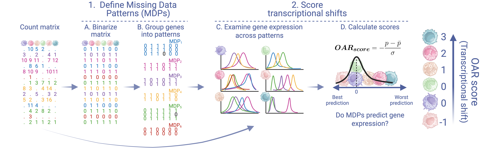

# OARscRNA 

## Heterogeneity scoring on scRNAseq data based on missingness

The OAR (observed at random) score reveals cellular heterogeneity, allowing **cell prioritization** for downstream applications. For best results, apply the test to group of similar cells where you expect some heterogeneity - *i.e. one cell type across various biological samples or conditions*. OAR scores are cluster agnostic (no cluster labels are required) and are robust across:

-   Technologies
-   Technical batches/library preparations
-   Organisms

**OAR score is a measure of heterogeneity among cells**. A cell with a **positive** OAR score is one where a set of genes appears to be expressed more homogeneously than in other cells tested, and is consequently a highly distinct cell.

## Motivation

scRNAseq data is very sparse (50-90% of expression values are 0). Sparsity is *generally* attributed to technical limitations associated with capturing RNA molecules from individual cells. **Some 0s are expected**, and are a consequence of the Gamma-Poisson distribution of count data[^index-1], whereas “Drop-out” (when 0s occur where positive counts are expected) is a problem associated with specific technologies (UMI- vs. nonUMI-based)[^index-2].

[^index-1]: Svensson, V. (2020). Droplet scRNA-seq is not zero-inflated [DOI: 10.1038/s41587-019-0379-5](https://www.nature.com/articles/s41587-019-0379-5)

[^index-2]: Cao, Y. *et. al.* (2021). UMI or not UMI, that is the question for scRNA-seq zero-inflation [DOI: 10.1038/s41587-020-00810-6](https://www.nature.com/articles/s41587-020-00810-6)

Sparsity has been used to:

-   [Cluster cells](https://doi.org/10.1038/s41467-020-14976-9)
-   [Define variable genes](https://academic.oup.com/bioinformatics/article/35/16/2865/5258099)

**Is there something else we can learn about cellular identity from sparsity in scRNAseq data?** **Is sparsity (\~missingness) occurring completely at random?**

## Test overview

At the core of the OAR score is the identification of missing data patterns, followed by comparing the distribution of genes expressed in the identified patterns in each cell individually.

To calculate the OAR score we:

1.  Estimate [Hamming distances](https://en.wikipedia.org/wiki/Hamming_distance) between binarized vectors of gene expression.
2.  Group genes across missing data patterns based on hamming distances between them. Genes with unique patterns *- i.e. with no "neighbors"*, are grouped together.
3.  Compare the distribution of gene expression across identified patterns for *each cell* with a [Kruskal-Wallis](https://en.wikipedia.org/wiki/Kruskal%E2%80%93Wallis_test) test.
4.  Scale the resulting *corrected p value* distributions *across all cells* to obtain the **OAR score**.

## Installation

To install the latest version of our package, run:

`devtools::install_github("Sanin-Lab/OARscRNA")`

If you want to install our vignettes (takes a few minutes!), try:

`devtools::install_github("Sanin-Lab/OARscRNA", build_vignettes = TRUE)`

**For Mac and Linux users**: The package uses `FastHamming::hamming_distance()` to speed up the hamming distance calculation. Unless `OpenMP` is installed in your computer, the function will default to use all available threads. To install via Homebrew run on your terminal: `brew install libomp`

## Usage

To calculate an OAR score from a Seurat object with **default** parameters run:

`oar(data = seurat.obj)`

Or from a matrix of **unnormalized** read counts, run:

`oar(data = read.counts, seurat_v5 = F)`

This will automatically filter genes with low expression, identify a suitable tolerance for the hamming distance, and return a OAR score, corrected and uncorrected p values and percentage of missing data for each cell (column) in the supplied object.

-   If a Seurat object is supplied, the results are added as columns in the `meta.data` slot.

For full details on all parameters, including a step-by-step breakdown of the process, please visit our [documentation](https://sanin-lab.github.io/OARscRNA/) or view our vignettes with `browseVignettes(package = "OAR")`.

## Tutorials and Applications

### Quick overview

Follow our quick guide on running the analysis with a single line: `vignette("introductory_vignette")`

### Cell prioritization for downstream analysis

Follow our step-by-step tutorial on exploring how we can identify highly activated plasmacytoid dendritic cells based on a high OAR score: `vignette("detailed_tutorial")`

### Model gene expression data at the single cell level

Identify genes responsible for high OAR scoring cells at a single cell resolution: `vignette("Gene_expression")`

### Remove sources of variation from scRNAseq data analysis

Regress out OAR scores calculated on raw counts and found to be associated with unwanted sources of variation (batches, low quality cells, individual samples) to remove confounding factors.

## References

*scRNAseq implementation:* Chen, R., Moore, H., Gueguen, PM., Kelly, B., Fertig, EJ., Sanin, DE., (2025). Scoring Cellular Heterogeneity by interrogating Missingness in single-cell RNA-seq Data. *In press*

*Statistical proof:* Chen, R., Chung, YC., Basu, S., Shi, Q., (2024). Diagnostic Test for Realized Missingness in Mixed-type Data. Sankhya B, 86(1), 109-138. DOI: 10.1007/s13571-023-00317-5

*Copyright 2025 - The Johns Hopkins University*
